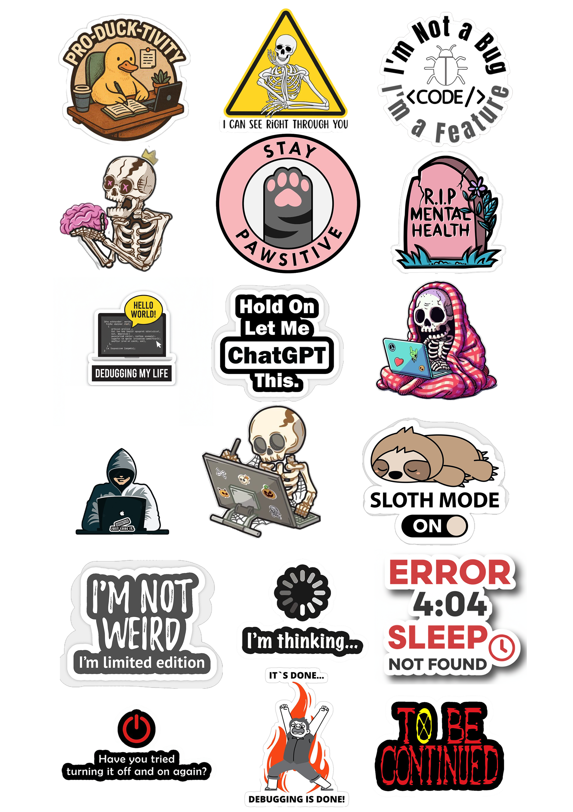
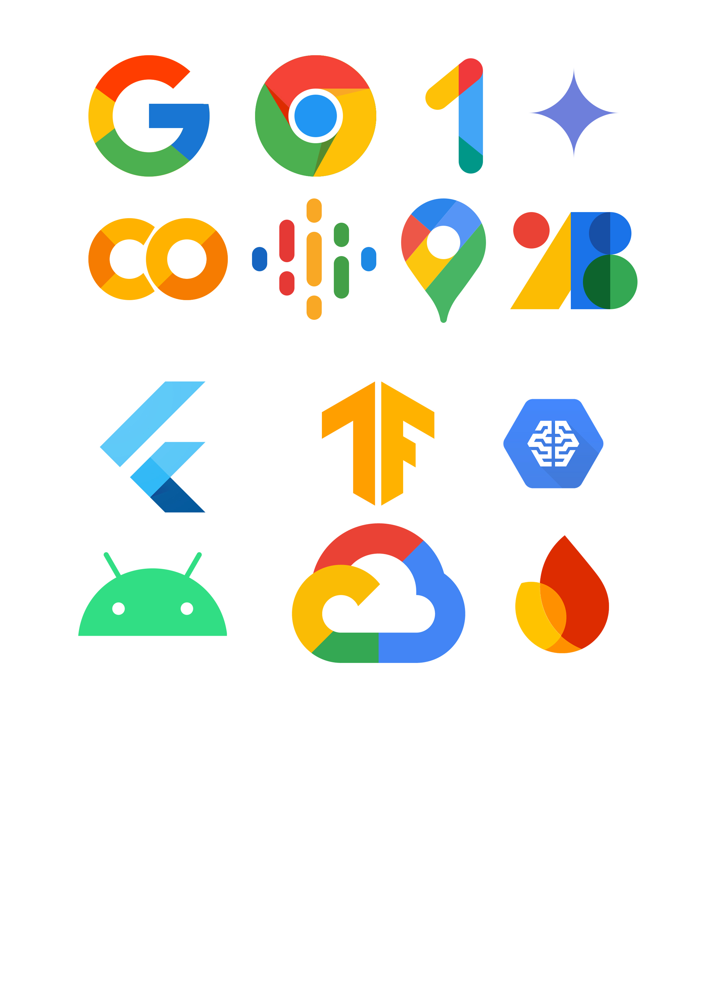

# 🎨 GDG Sticker Design Collection

A creative sticker design collection created for a **Google Developer Groups (GDG)** community/event.

## 📌 About the Project

This project contains a collection of technology-themed sticker designs created for the GDG community.

The designs focus on developer culture, technology, programming, cloud, AI, and modern digital tools.

## 🎯 Objective

The main objective was to create visually engaging and creative stickers that represent the developer community and technology ecosystem.

## 🎨 Design Highlights

- Technology-focused sticker designs
- Developer and programming themes
- Google ecosystem inspired elements
- Creative illustrations and typography
- Multiple design concepts and variations
- High-quality digital artwork

## 🛠️ Tools Used

- Adobe Photoshop
- Digital Illustration
- Graphic Design
- Image Editing
- Typography
- Creative Visual Design

## 🖼️ Preview

### Sticker Collection



### Additional Designs



## 📂 Project Structure

```text
gdg-sticker-design/
│
├── final-designs/
│   └── Final PNG designs
│
├── source-files/
│   └── Editable PSD files
│
├── previews/
│   └── Preview images
│
└── README.md
